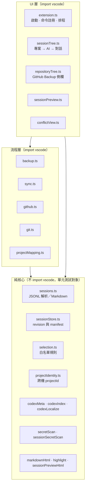

# AI Session Backup


VS Code 擴充功能：以 append-only 格式備份 Claude Code 與 Codex 的 JSONL session，
並在多台電腦之間安全合併。每份內容以 SHA-256 建立不可變 revision，
同步流程完全非互動，衝突不跳視窗而是收進側欄等你有空再處理。
預設本地備份庫是 `~/.session-backup`。

---

## 技術堆疊

| 項目 | 版本／說明 |
| --- | --- |
| 語言 | TypeScript 5.4（`strict: true`，target ES2022，module commonjs） |
| 執行環境 | VS Code Extension Host，`engines.vscode ^1.85.0`、`@types/node ^20` |
| 執行期相依 | **無** — 只用 Node 內建模組與 VS Code API |
| 版本控制 | 直接呼叫系統 `git` CLI（不引入 git 函式庫） |
| 遠端 | GitHub REST API + VS Code 內建 GitHub 驗證；亦支援手動 remote URL（GitLab／Gitea／GHE） |
| 測試 | Node 內建 `node:test` + `node:assert`，23 個測試檔 |
| 格式化 | Prettier 3.9.5 |
| 打包 | `vsce package` 產生 VSIX |


## 專案架構

三層結構，依「是否碰得到 VS Code API」切分 — 這條線同時也是可測試性的界線：



備份庫（`~/.session-backup`）本身就是一個 git repo，內容格式為：

```text
format.json
store/<tool>/<session-id>/<sha256>.jsonl      不可變 revision
machines/<machine-id>/manifest.json           這台電腦備份了哪些 revision
machines/<machine-id>/resolutions.json        衝突處理決定
```

資料流：掃描來源 → 依追蹤白名單過濾 → 內容 SHA-256 → 寫入 store → 金鑰掃描 →
commit → push；同步則是 pull 後比對 manifest，以 no-delete 規則合併
（其他電腦不存在的 session 永遠不刪）。

## 快速開始

### 前置需求

- VS Code 1.85 以上
- Node.js 20 以上（僅開發／建置需要）
- 系統已安裝 `git`
- 一個**私人** GitHub 儲存庫（或任何可寫入的 git server）

### 安裝

```bash
git clone https://github.com/Leo890728/SessionBackup.git
cd SessionBackup
npm install
npm run compile
```

之後按 **F5** 以開發模式啟動，或打包成 VSIX 安裝：

```bash
npm run package                                    # 產生 session-backup-<version>.vsix
code --install-extension session-backup-0.5.2.vsix
```

### 首次設定

1. 執行 **Session Backup: 連接備份儲存庫** — 用 VS Code 的 GitHub 登入在個人帳號或
   所屬組織底下建立／連結私人 repo；其他 git server（GitLab、Gitea、GitHub Enterprise、
   別人分享的 repo）選「手動輸入 remote URL」，認證沿用 git 既有憑證。
2. `sessionBackup.machineId` 留空即可，會自動用「主機名稱 + VS Code 安裝識別碼短雜湊」，
   同名主機也不會撞。此設定為 machine-scoped，不會被 Settings Sync 帶到其他電腦。
3. 在活動列的 **Session Backup → Sessions** 勾選要追蹤的對話
   （可勾單一對話、整個專案或整個工具）。
4. 執行 **Session Backup: 立即備份**。
5. 在另一台電腦重複 1～2，然後執行 **Session Backup: 同步並合併其他電腦紀錄...**。

## 專案結構

```text
src/
  extension.ts                     啟動流程、命令註冊、自動備份排程、設定變更處理
  backup.ts  sync.ts               備份與同步兩條主流程
  git.ts  github.ts                git CLI 包裝、GitHub REST 與驗證
  sessionStore.ts                  revision 雜湊、manifest 讀寫、store 路徑規則
  sessions.ts                      JSONL 解析、對話標題、Markdown 匯出
  selection.ts                     三層白名單規則與優先序
  projectIdentity.ts               跨機 projectId 推導
  projectMapping.ts                projectId ↔ 本機資料夾對應（存 global storage）
  codexMeta/Index/Localize.ts      Codex rollout schema、標題索引、cwd 本地化
  secretScan.ts  sessionSecretScan.ts  備份前的金鑰偵測
  secretReviewView.ts              金鑰命中的逐一確認面板
  sessionTree.ts  repositoryTree.ts  兩個側欄 TreeDataProvider
  sessionPreview*.ts  markdownHtml.ts  highlight.ts   預覽 webview
  conflicts.ts  conflictView.ts    衝突紀錄與左右比較視窗
  *.test.ts                        與被測模組同層的單元測試
media/                             活動列圖示與各 AI 標誌
out/                               tsc 輸出（不進版控）
```

## 主要功能

### 備份內容

備份是**選擇制**：只備份你在 Sessions 側欄勾選的對話，沒勾的不備份、不觸發變更偵測，
同步時也不會從其他電腦匯入。

勾選的對話只取聊天紀錄，不鏡像整個 `.claude` 或 `.codex`：

- Claude Code：`projects/**/*.jsonl`、`sessions/**/*.jsonl`
- Codex：`sessions/**/*.jsonl`、`archived_sessions/**/*.jsonl`

憑證、設定、skills、plugins、SQLite、cache、sandbox 與暫存檔不會進入 store。

### 選擇要追蹤的對話

在 **Sessions** 側欄用核取方塊勾選，結果存在 `sessionBackup.trackedSessions`：

| 勾選位置 | 規則 | 涵蓋範圍 |
| --- | --- | --- |
| 專案節點 | 複合套用底下兩個 AI 的規則 | Claude Code 含之後新增的對話；Codex 只有當下已有的對話 |
| 專案下的 Claude Code 節點 | `claudeProject:<projects 目錄名>` | 該專案全部 Claude Code 對話，**含之後新增的** |
| 專案下的 Codex 節點 | （逐一套用到該工作目錄目前的對話） | 只有當下那些 Codex 對話，不含之後新增的 |
| 單一對話 | `session:<tool>:<sessionId>` | 該 thread 的所有 rollout 檔 |

- 前綴 `-` 代表排除（如 `-session:codex:019f44…`）。
- 既有的 `tool:claude`／`tool:codex` 全工具規則仍會生效；新樹狀結構不會從專案內的
  AI 節點新增全工具規則。
- 判定時**越具體的規則越優先**：session > claudeProject > tool。
  可以勾整個專案再單獨取消其中一個對話，也可以在沒勾整個工具的情況下只勾幾個對話。
- 沒有任何規則涵蓋的對話完全不參與備份流程：不上傳、不列入「有變動的 sessions」、
  同步時也不會被其他電腦的版本覆寫。
- 取消勾選只影響之後的備份，**已上傳到 GitHub 的舊備份不會被刪除**。
- 從其他電腦同步匯入的對話會自動納入追蹤 — 它本來就在備份裡，
  否則匯入後反而不會再被備份。
- 也可用 **Session Backup: 管理追蹤的對話...** 檢視並刪除追蹤規則。

> 從 0.2.x 升級：首次啟動會把本機 manifest 中**已經備份過**的對話設為追蹤，
> 既有備份不會突然停止更新；之後新增的對話則要自己勾選。
> 舊的 `sessionBackup.ignoredSessions` 會自動移除。

### 非互動同步與衝突處理

同步完全不打斷你（自動排程也會執行：每次定時備份前先拉遠端合併）：

- 內容相同：略過。
- 遠端是本機的完整延伸：自動採用較長版本。
- 本機是遠端的完整延伸：保留本機。
- 目標檔案使用中（兩分鐘內有寫入）：延後到下次同步，不覆寫進行中的對話。
- 兩邊從同一 session 分叉：**不會跳視窗**，記錄為衝突顯示在側欄
  GitHub Backup 的「衝突」區塊，之後有空再逐一處理。

點擊衝突項目開啟左右比較視窗（可獨立或同步捲動 A/B 對話）：

- **保留 A**：把遠端版本寫入本機；本機原內容仍保存在 store，可反悔。
- **保留 B**：維持本機並記住此選擇；遠端出現新 revision 時才會再次成為衝突。
- **跳過這次**（或關閉視窗）：衝突留在清單中，之後再處理。

Codex 標題（`session_index.jsonl`）以 `updated_at` 新者勝，不會被其他電腦的舊標題覆蓋。

### Claude 專案重新定位

Claude Code 以本機專案路徑區分 session。擴充功能不把 A 電腦的 project bucket 直接複製到 B，
而是使用跨機 `projectId`：

- 有 remote 的 Git 專案：由正規化 Git remote 的 hash 加上 repository-relative
  workspace path 產生（`git-<hash>`），可自動對應不同 checkout 路徑與 monorepo 子目錄。
- 沒有 remote 的 Git 專案：改用 root commit（`root-<hash>`）。clone 或整包複製過去的
  同一個 repo 在兩台電腦仍算同一個專案，即使還沒 push。
- 非 Git 專案：第一次在另一台電腦同步時要求選擇本機資料夾。
- 本機對應保存於 VS Code extension global storage 的 `project-mappings.json`，
  不會 commit 到共享備份庫。
- 共享 manifest 只保存 `projectId`、顯示名稱、remote hash 與 repository-relative path，
  不保存本機絕對路徑或 Claude 的路徑 bucket。

找不到對應時同步不中斷也不詢問：該專案在 **Sessions** 側邊欄顯示成 ☁ 待對應節點，
點擊才進入「使用目前工作區 / 選擇本機資料夾」，指定後自動再同步一次。之後可執行
**Session Backup: 管理 Claude 專案對應...** 重新定位或移除對應。

完全不是 git repo（或還沒有任何 commit）時，`projectId` 才會退回以絕對路徑計算的
`local-<hash>`，跨機必然配不上，只能手動指定一次。專案身分是第一次見到它時定下來的，
但只要還停在 `local-`，之後每次備份都會再偵測一次 git；等到那個資料夾 `git init`
或加上 remote，身分就會自動升級（每次執行只重試一次，不會拖慢備份）。

共享 store 仍保存未修改的原始 JSONL；JSONL 本身可能含來源電腦的 `cwd`。匯入 B 時
只改變 materialize 位置，不全文取代對話或工具輸出中的路徑。

### Codex 工作目錄本地化

Codex 以 `session_meta.payload.cwd` 決定 session 屬於哪個工作目錄 — A 電腦在 `C:\`、
B 電腦在 `D:\` 時，這個欄位視為**機器本地屬性**處理：

- manifest 對 codex session 也記錄跨機 `projectId`（remote 或 root commit 推導，
  與 Claude 共用同一套專案映射）。
- **匯入**其他電腦的 session 時，若本機已有對應專案，`session_meta.cwd` 會改寫成本機路徑，
  Codex 才能在本機工作目錄列出它；找不到映射就保持原樣。
- **更新**既有檔案時保留本機原本的 cwd，不會被其他電腦的路徑覆蓋。
- 同步比對會忽略 `session_meta.cwd` 與 `turn_context` 的 `cwd`/`workspace_roots` —
  兩台電腦只差路徑的檔案視為相同，不會誤判分叉。
- 非 git 專案的 projectId 依路徑推導、跨機不穩定，這類 codex session 匯入時不做
  cwd 本地化（內容仍完整同步）。

### Session 瀏覽器

活動列的 **Session Backup** 圖示會顯示本機 session：

- Sessions 採 **專案 → AI（Claude Code / Codex）→ 對話** 三層結構；兩種 AI 的工作目錄
  相同時會合併到同一個專案，專案與對話皆以最近更新優先排列。
- Codex 子代理 thread（session_meta 含 `parent_thread_id`，如 guardian）不會當獨立
  session 顯示，而是掛在父 thread 最新 rollout 檔的節點下展開；父檔案已被 Codex 清除的
  子 thread 不顯示（仍會照常備份）。
- 本機解不出位置的專案收在最上面的 **未對應專案** 那一層（預設收合），不與已對應的
  專案混在一起：包含其他電腦備份過但本機還沒有檔案的 Claude 專案，以及本機有檔案、
  但工作目錄是別台電腦路徑的對話。
- 專案、AI 與對話節點左側都有核取方塊，用來決定備份哪些對話。
- 備份狀態比照檔案總管的 git 裝飾，以列尾字母表示（比對本機 manifest，不需連網）：
  - **U**（綠）**待備份** — 已勾選但備份庫裡還沒有
  - **M**（黃）**未同步** — 備份後有新內容，下次備份會更新
  - **!**（紅）**跳過（過大）** — 超過 `maxFileSizeMB` 上限
  - **整列變暗** — 未追蹤，備份與同步都會跳過；整個專案／AI 都沒勾選時該層也會變暗
  - 已同步不顯示任何標記
- 點擊 session 可預覽 Markdown；可從預覽頁直接回到 Claude Code 或 Codex 的原生對話視窗。
- 預覽開啟時停在最新訊息；下次備份會寫入的對話會有一條橫桿標出「已備份到哪裡」，
  位置取自已備份 revision 與現況的共同前綴，捲過之後會黏在標題列下方。
- 右鍵可匯出 Markdown、開啟原始 JSONL、納入或取消追蹤。

側邊欄頂端的 **GitHub Backup** 會依狀態顯示操作：

- 尚未設定遠端：**連接備份儲存庫**。
- 已連接但遠端尚無備份分支：**備份至遠端儲存庫**，像 Source Control 的 Publish 動作一樣
  建立第一個 commit 並 push。
- 已有備份：顯示 `owner/repo` 與最近備份時間；點擊可立即再次備份。
- 偵測到本機變更時，狀態磚下方會展開「**有變動的 sessions**」清單（類似 Source Control
  的 Changes）：以 **U**／**M** 標示新增或已變更、顯示可讀標題，點擊可預覽對話；
  最多列 30 筆，其餘以「…還有 N 個」摘要。

### 安全機制

- Session 本身可能包含提示詞、原始碼、工具輸出、路徑或金鑰，
  **遠端必須使用私人儲存庫**。
- commit 前會掃描常見 Anthropic、OpenAI、GitHub、AWS、Slack、Google 金鑰與私鑰標頭。
- 手動備份命中時會開確認面板，逐一詢問每個 session（可勾「後續都這樣處理」），
  並顯示命中處前後的原文以判斷誤判（命中處以標記色標出，照實顯示）。
- 每個 session 可選「跳過此次」「取消追蹤」「仍要備份」。取消追蹤會寫入
  `sessionBackup.trackedSessions` 的排除規則：該 session 之後不備份、不觸發變更偵測，
  多機同步時也不會從其他電腦匯入回本機；已上傳的舊備份不會被刪除。
- 掃描只攔截，不會改寫本機對話紀錄；金鑰進過紀錄就該撤銷換發，而不是從檔案裡擦掉。
- 自動備份不開面板搶焦點，提示是右下角通知，對全部命中做同一個決定，
  五分鐘沒回應就當作取消這次備份，下次再問；
  中途手動按備份會直接接手，不必等它逾時。
- GitHub token 只透過 `http.extraHeader` 傳給 Git，不寫入 `.git/config`。
- 單檔超過 `sessionBackup.maxFileSizeMB` 時略過，預設 95 MB。

## 命令

| 命令 | 說明 |
| --- | --- |
| `Session Backup: 立即備份` | 收集 session → 建立 revision → secret 掃描 → commit → push |
| `Session Backup: 連接備份儲存庫` | 在個人／組織底下建立或連結私人 repo，或手動輸入任何 git server 的 remote URL |
| `Session Backup: 重新連接備份儲存庫` | 換連到另一個備份儲存庫 |
| `Session Backup: 備份至遠端儲存庫` | 建立第一份安全掃描過的備份並 push |
| `Session Backup: 同步並合併其他電腦紀錄...` | 備份本機、取得遠端並以 no-delete 規則合併 |
| `Session Backup: 管理 Claude 專案對應...` | 重新定位、開啟或移除本機 projectId 對應 |
| `Session Backup: 管理追蹤的對話...` | 檢視追蹤規則，勾選即可刪除 |
| `Session Backup: 重新登入 GitHub` | 換用另一個 GitHub 帳號 |
| `Session Backup: 開啟本地備份儲存庫資料夾` | 開啟 `~/.session-backup` |
| `Session Backup: 顯示記錄` | 顯示輸出面板 |

開啟 `sessionBackup.debugCommands` 後另有三個具破壞性的除錯命令（刪除遠端備份儲存庫／
登出 GitHub／刪除本機備份資料），執行前都會再次確認；`~/.claude`、`~/.codex` 裡的
原始對話檔一律不會被刪除。

## 設定

| 設定 | 預設 | 說明 |
| --- | --- | --- |
| `sessionBackup.repoPath` | `""` | 本地備份 Git 儲存庫路徑，留空為 `~/.session-backup` |
| `sessionBackup.repoName` | `agent-session-backup` | 建立或尋找備份儲存庫時的名稱；連接之後改它不會換 repo |
| `sessionBackup.machineId` | `""` | 此電腦在備份庫中的識別名稱，machine-scoped、不隨 Settings Sync |
| `sessionBackup.autoBackupMinutes` | `30` | 自動備份間隔（分鐘），0 表示停用 |
| `sessionBackup.backupOnStartup` | `false` | VS Code 啟動時自動備份一次 |
| `sessionBackup.maxFileSizeMB` | `95` | 單檔大小上限，超過略過（GitHub 硬限制 100 MB） |
| `sessionBackup.secretScan` | `true` | commit 前掃描疑似 API 金鑰／憑證 |
| `sessionBackup.trackedSessions` | `[]` | 追蹤白名單規則（建議用側欄核取方塊管理） |
| `sessionBackup.sources` | claude／codex | 來源根目錄，只讀 `projects`、`sessions`、`archived_sessions` 下的 JSONL |
| `sessionBackup.debugCommands` | `false` | 在命令面板顯示除錯／重置命令 |

`sessionBackup.ignoredSessions` 與 `sessionBackup.selectedSessions` 都已由
`trackedSessions` 取代，啟動時自動轉換並移除。

## 開發流程

```bash
npm install           # 安裝開發相依（無執行期相依）
npm test              # compile 後執行 node --test out/*.test.js
npm run compile       # tsc -p ./
npm run watch         # tsc -w，開發時常駐
npm run package       # vsce package 產生 VSIX
npm run backup:local  # 不開 VS Code，直接重建本地備份庫（rebuildLocal.ts）
```

按 **F5**（`Run Extension`）會先跑 `npm: compile` 再開啟 Extension Development Host。

分支策略：主線為 `main`，直接在 `main` 上以小顆粒 commit 推進。Commit message 採
Conventional Commits 前綴（`feat:`／`fix:`／`chore:`／`docs:`／`refactor:`），說明使用
繁體中文，例如 `fix: 只重寫 mtime 的舊對話不再被誤判成新版本`。發版時以
`chore: <version>` 對應 `package.json` 的 version bump。

## 程式碼慣例

- **TypeScript strict**：不關 `strict`，不用 `any` 逃逸。
- **零執行期相依**：新增功能前先問能不能用 Node 內建或自己寫；引入 runtime 套件需要
  明確理由（見 [highlight.ts](src/highlight.ts) 與 [markdownHtml.ts](src/markdownHtml.ts)
  開頭記錄的取捨）。
- **純核心與 VS Code 隔離**：可測邏輯不 `import vscode`，side effect 與 UI 留在
  `extension.ts` 與 `*Tree.ts`／`*View.ts`。
- **註解寫「為什麼」**：模組開頭的 doc comment 解釋設計取捨與不變條件（例如
  [machineIdentity.ts](src/machineIdentity.ts) 說明為何不用 MAC address），
  而不是複述程式碼。
- **webview 安全**：所有對話內容都必須經過 `escapeHtml`／`renderMarkdown` 再輸出，
  CSP 維持 `default-src 'none'`。
- **穩定的字串常數**：selection 規則前綴、store 路徑規則等一旦發布就不能改，
  改了會讓既有紀錄對不上。
- 格式化交給 Prettier 3（預設設定）；中文與英數之間留一個空格。

## 測試

```bash
npm test
```

- 使用 Node 內建 `node:test` + `node:assert`，不引入測試框架。
- 測試檔與被測模組同層，命名為 `<module>.test.ts`，編譯後由 `node --test out/*.test.js` 執行。
- 只測不依賴 VS Code API 的純模組 — 這是把邏輯推出 UI 層的主要動機。
  目前 21 個測試檔涵蓋 selection 規則優先序、store revision 與 manifest、
  Codex meta/index/cwd 本地化、金鑰掃描規則、Markdown 與語法上色、
  sync 判定、專案識別、衝突與側欄狀態。
- 沒有 CI；送出變更前請在本機跑過 `npm test`。

## 貢獻

1. 從 `main` 開分支，或直接在 fork 上作業。
2. 動手前先讀 [REFACTORING_REPORT.md](REFACTORING_REPORT.md) — 裡面記錄了目前的結構評估、
   已完成的重構與後續候選，可避免重複處理同一批問題。
3. 找一個相近的既有模組當範本：純邏輯看 [selection.ts](src/selection.ts)、
   格式知識集中看 [codexMeta.ts](src/codexMeta.ts)、側欄看 [sessionTree.ts](src/sessionTree.ts)。
4. 新增或修改邏輯時一併補上 `*.test.ts`；改動涉及 store 格式或 selection 規則時，
   要說明既有備份的相容路徑。
5. 送出前跑 `npm test` 與 `npm run compile`，commit message 用 Conventional Commits 前綴。

回報問題請附上 **Session Backup: 顯示記錄** 的輸出，並注意記錄中可能含有路徑等個人資訊。

## 授權

MIT License，Copyright (c) 2026 Leo890728。詳見 [LICENSE](LICENSE)。
